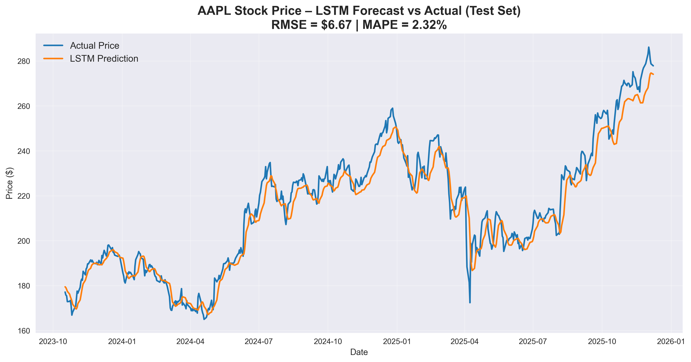

# AAPL Stock Price Forecaster – LSTM Neural Network



**Live Demo** → https://aapl-lstm-forecaster.streamlit.app
**Test Set Results** → **RMSE $6.67** | **MAPE 2.32%**

### Project Overview
End-to-end stock price forecasting pipeline built entirely in VS Code (zero Jupyter notebooks).

- Trained LSTM on 10+ years of AAPL data (2015 – Dec 2025)  
- Production-grade folder structure & modular code  
- TensorFlow 2.20 + Apple Silicon GPU acceleration  
- Early stopping + best-model checkpointing  
- Fully deployed on Streamlit Cloud  

**Note**: Due to yfinance rate-limiting on Streamlit Cloud, the live demo uses a cached recent price snapshot. Locally the app pulls live data perfectly.

### Live App Shows
- Current AAPL price (cached snapshot)  
- Next-day LSTM price prediction  
- Last 120 trading days + tomorrow’s forecast  
- Clean, custom-themed interface

### Tech Stack
- Python 3.11  
- TensorFlow 2.20.0  
- pandas, numpy, scikit-learn, yfinance  
- matplotlib, seaborn, plotly  
- Streamlit (deployment)


### Run Locally (100% live data)
```bash
git clone https://github.com/YOUR_GITHUB_USERNAME/aapl-lstm-forecaster.git
cd aapl-lstm-forecaster

python -m venv .venv
source .venv/bin/activate        # Windows: .venv\Scripts\activate
pip install -r requirements.txt
pip install tensorflow==2.20.0

# View results
python -m scripts.05_evaluate

# Launch web app with real-time prices
streamlit run app/app.py